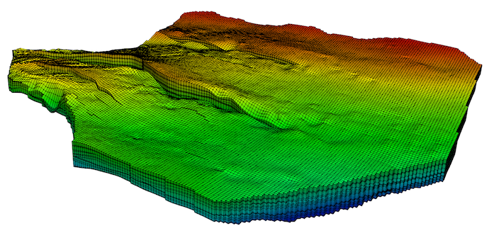

# One-step conversion from reservoir Earth models to Exodus II format

[](https://github.com/cpgr/em2ex/actions/workflows/em2ex.yml)

`em2ex` is a python program that converts a reservoir model to an Exodus II file that can then be used in
a simulation tool (such as [MOOSE](http://www.mooseframework.org)) or viewed in a visualisation tool (such as [Paraview](https://www.paraview.org)).



[*Johansen formation*](https://www.sintef.no/projectweb/matmora/downloads/johansen/) *converted to Exodus format from Eclipse dataset*

Currently, `em2ex` supports two reservoir modelling formats:

- Eclipse (ASCII files)
- Leapfrog Geothermal (CSV files)

## Setup

`em2ex` is a pure python program that does not depend on any external libraries (but does require a few common python packages), so can run on any system with a working python installation.

### Clone repository

`em2ex` can be installed by cloning this repository from GitHub using
```bash
git clone git@github.com:cpgr/em2ex.git
```
or
```bash
git clone https://github.com/cpgr/em2ex.git
```
This will add a folder `em2ex` containing the code.

### Required python packages

The following python packages are required to run `em2ex`

- numpy
- pandas
- netCDF4

The first two are typically already installed, but if not, can be installed using `pip`. The `netCDF4` package can be installed using `pip` as well:
```bash
pip install netcdf4
```

Two additional python package, `pytest` and `pyYAML` are required to run the test script. Again, these can be installed using `pip`, e.g.
```bash
pip install pytest
```

### Optional Exodus API

`em2ex` can optionally use the `Exodus II` API instead of the simplified `pyexodus` API included in the code, which is available through the [`SEACAS`](https://github.com/gsjaardema/seacas) package.

For [MOOSE](http://www.mooseframework.org) users, this package is installed as part of
the default environment. To use the Exodus python API, the path to the python API in the SEACAS package (`/opt/moose/seacas/lib`) should be added to the `PYTHONPATH` environment variable
```bash
export PYTHONPATH=$PYTHONPATH:/opt/moose/seacas/lib
```

For non-MOOSE users, `SEACAS` can be installed manually and the location of `exodus.py` added to `PYTHONPATH`.

## Usage

To convert a reservoir model to an Exodus II file, run

```bash
./em2ex.py filename
```

which produces an Exodus II file `filenanem.e` with the cell-centred reservoir properties saved
as elemental variables, and nodal properties saved as nodal variables.

For example, the `test/eclipse` directory contains several ASCII Eclipse reservoir model (`.grdecl` file extension). These can be converted to an Exodus II file using
```bash
./em2ex.py simple_cube.grdecl
```

Similarly, the `test/leapfrog` directory contains a set of example Leapfrog reservoir model files that can be converted to Exodus II files using
```bash
./em2ex.py test
```
for example.

## Commandline options

A number of optional commandline options are available, and can be seen by passing the `--help` flag:
```bash
$ ./em2ex.py --help

usage: em2ex.py [-h] [-o OUTPUT_FILE] [--filetype {eclipse,leapfrog}]
                [--no-nodesets] [--no-sidesets] [-f] [-u] [--flip]
                [--translate TRANSLATE TRANSLATE] [--mapaxes] [--pinch]
                [--pinch-tol PINCH_TOL] [--refine-xy RX RY]
                [--extract-i I_LO I_HI] [--extract-j J_LO J_HI]
                [--extract-k K_LO K_HI] [--extra-keywords KEY [KEY ...]]
                filename

Converts earth model to Exodus II format

positional arguments:
  filename

options:
  -h, --help            show this help message and exit
  -o OUTPUT_FILE, --output OUTPUT_FILE
                        File name for output
  --filetype {eclipse,leapfrog}
                        Explicitly state the filetype for unknown extensions
  --no-nodesets         Disable addition of nodesets
  --no-sidesets         Disable addition of sidesets
  -f, --force           Overwrite filename.e if it exists
  -u, --use-official-api
                        Use exodus.py to write files
  --flip                Flip the sign of the Z coordinates
  --translate TRANSLATE TRANSLATE
                        Translate the (x, y) coordinates by this amount
  --mapaxes             Use the MAPAXES coordinates for an Eclipse file
  --pinch               Remove pinched elements
  --pinch-tol PINCH_TOL
                        Tolerance for coincident corners when removing pinched
                        elements (default: 1e-3)
  --refine-xy RX RY     Refine the grid laterally by integer factors RX in x
                        and RY in y (vertical resolution unchanged). Each
                        child cell inherits its parent's element properties.
  --extract-i I_LO I_HI
                        Extract cells I_LO..I_HI along the x-axis (1-based
                        inclusive, Eclipse-style). Cells are taken in file
                        order, before any coordinate-system normalisation;
                        runs before --refine-xy if both are given.
  --extract-j J_LO J_HI
                        Extract cells J_LO..J_HI along the y-axis (1-based
                        inclusive).
  --extract-k K_LO K_HI
                        Extract cells K_LO..K_HI along the z-axis (1-based
                        inclusive).
  --extra-keywords KEY [KEY ...]
                        Additional per-cell property keywords to read from the
                        grdecl file (e.g. PVTNUM EQLNUM FIPNUM). Each must be
                        a per-cell scalar of length NX*NY*NZ. Normalised to
                        uppercase. The reader recognises ACTNUM, SATNUM, PORO,
                        PERMX, PERMY, PERMZ, NTG, HEATCR and THCONR by
                        default.
```

### Lateral refinement (Eclipse only)

The `--refine-xy RX RY` option refines an Eclipse grid in the (x, y) plane by integer factors `RX` and `RY`, leaving vertical resolution unchanged. This is useful for `grdecl` models whose cells are long and wide but thin: each parent cell is split into `RX * RY` children (so `--refine-xy 2 2` turns one cell into four, not eight). Pillars are linearly interpolated to create new (x, y) coordinates, per-cell top and bottom faces are bilinearly interpolated within each parent (which preserves faults), and each child cell inherits all of its parent's element properties (`PORO`, `PERMX`, `SATNUM`, `ACTNUM`, etc.).

```bash
./em2ex.py --refine-xy 2 2 simple_cube.grdecl
```

`RX` and `RY` must be strictly positive integers; anything else is rejected up front with an informative error.

### Extracting a subset (Eclipse only)

The `--extract-i`, `--extract-j` and `--extract-k` options pull a rectangular subset of cells out of a `grdecl` model along the x-, y- and z-axes respectively. Each takes two 1-based inclusive cell indices (Eclipse-style, matching the `BOX` keyword), and each is independently optional — any axis you don't restrict is kept in full. For example, to keep only cells `i=10..30, j=5..40` across every layer:

```bash
./em2ex.py --extract-i 10 30 --extract-j 5 40 large.grdecl
```

Or to take only the top 20 layers:

```bash
./em2ex.py --extract-k 1 20 large.grdecl
```

Indices refer to cell positions **as they appear in the file** — same numbering you see in the `SPECGRID` keyword and in the order properties like `PORO` are listed. The subset is taken before any further coordinate processing.

**Composition with `--refine-xy`.** If both are given, extract runs first and refinement applies to the subset (so `--extract-i 10 30 --refine-xy 2 2` extracts 21 cells along the x-axis and then refines to 42; it does *not* refine the full grid and then extract from it). This is almost always what you want — refining the whole grid just to throw most of it away would be wasteful.

**Composition with `--flip` and with left-hand coordinate files.** Extract operates on the file's i/j/k indexing *before* `em2ex` flips the z values (`--flip`) or normalises a left-handed coordinate system to right-handed (which happens automatically when the file's x or y coordinates decrease). The practical consequence:

- `--flip` doesn't affect which cells are extracted — only their z sign in the output. The k range you give is the same range you'd give without `--flip`.
- For a left-handed coordinate file, the extracted region is still the cells at file indices `i=I_LO..I_HI` (etc.), exactly as they're listed in `PORO`. In the output mesh, those cells then get re-numbered through the auto-flip to the canonical right-handed system, so their i (and/or j) indices in the produced Exodus mesh may run in the opposite direction from the file's. The geometry and properties are preserved; only the index sense changes.

If any range is out of bounds for the file's `SPECGRID` size, or if `LO > HI`, the conversion is rejected up front with the actual dimensions cited.

### Per-cell properties (Eclipse only)

`em2ex` recognises the following per-cell scalar property keywords out of the box and emits each as an elemental variable on the resulting Exodus mesh:

- `ACTNUM`, `SATNUM`
- `PORO`, `PERMX`, `PERMY`, `PERMZ`
- `NTG` (net-to-gross)
- `HEATCR` (volumetric heat capacity), `THCONR` (rock thermal conductivity)

The Eclipse keyword catalogue is much larger than this. If the model uses keywords the reader doesn't know about (e.g. `PVTNUM`, `EQLNUM`, `FIPNUM`, custom in-house names), pass them with `--extra-keywords`:

```bash
./em2ex.py --extra-keywords PVTNUM EQLNUM FIPNUM model.grdecl
```

A few practical notes:

- Keywords are normalised to uppercase, so `--extra-keywords ntg fipnum` and `--extra-keywords NTG FIPNUM` are equivalent.
- Each named keyword must be a per-cell scalar block of `NX*NY*NZ` entries terminated by `/`. The existing array-size check applies to extras the same as to defaults — a mismatched block size is rejected with the offending keyword named.
- If you ask for a keyword that doesn't appear in the file (or any of its `INCLUDE`d files), the conversion fails up front with the offending keyword named — typos in `--extra-keywords` are not silently ignored.
- Because `--extra-keywords` takes a variable number of values (`nargs='+'`), put the input filename **before** it, or separate them with `--`. Either of these works:
  ```bash
  ./em2ex.py model.grdecl --extra-keywords PVTNUM EQLNUM
  ./em2ex.py --extra-keywords PVTNUM EQLNUM -- model.grdecl
  ```

`em2ex` attempts to guess the reservoir model format from the file extension (see supported formats below). If the reservoir model has a non-standard file extension, the user can force
`em2ex` to read the correct format using the `--filetype` commandline option.

For example, if the reservoir model is named `model.dat` but is actually an Eclipse ASCII
file, then `em2ex` can still be used in the following manner
```bash
./em2ex.py --filetype eclipse model.dat
```

to produce an Exodus II model `test.e`.

If the [`SEACAS`](https://github.com/gsjaardema/seacas) package is installed, then the python API from that package can be used instead of the provided `pyexodus` API using
```bash
./em2ex.py --use-official-api test.grdecl
```

## Supported formats

`em2ex` currently supports:

| File format | File extension |
| ----------- | -------------- |
| Eclipse ASCII | `.grdecl`      |
| Leapfrog Geothermal | - |

## Note for Leapfrog Geothermal users

To prepare for usage, several steps must be taken in leapfrog.

First, the user must export a "block model" -- as a CSV with full header data.  Leapfrog gives three options for export of block models,

  1. **CSV Block Model - this option includes the model definition info on the top of the CSV file.  This option is required for use of this tool.**
  2. CSV Block Model + Text File - this option gives the same info as above, but in two files/
  3. CSV Points - a raw dump of the point data

The CSV Block Model file must contain all of the elemental (material property) data--anything that is cell entered.  You will need the rename to file to *filename*_cell.csv

Second, the user will need to create a second block model in Leapfrog that is n+1 bigger and with the base point being nx/2, ny/2, and nz/2 offset--this will make the second mesh centers align with the corners of the first mesh...giving the locations of the nodes.  In Leapfrog, you can interpolate the field estimated pressure and temperature onto this block model.  This second block model must be exported exactly the same as the first one.  You will need to rename the file to *filename*_node.csv

## Test suite

`em2ex` includes a python script `run_tests.py` which uses the [pytest](https://pytest.org) framework to run the included tests.

**Note:** The test suite generates and Exodus file from each reservoir model, and compares it with an existing Exodus file (the gold file). To compare these files, the test harness uses the `exodiff` utility (part of the [`SEACAS`](https://github.com/gsjaardema/seacas) package) to compare Exodus files. If this package is already installed (for example, as part of [MOOSE](http://www.mooseframework.org) or to utilise the Exodus API), then the test suite can be run using
```bash
./run_tests.py
```

Alternatively, to avoid installing the entire [`SEACAS`](https://github.com/gsjaardema/seacas) package just to run the test suite, the python [`pyexodiff`](https://github.com/cpgr/pyexodiff) package can be installed, and used in the test suite using
```bash
python -m pytest -v --exodiff=pyexodiff.py run_tests.py
```

New tests can be added anywhere within the `test` directory. The test harness recurses through this directory and all subdirectories looking for all instances of a `tests` file. This YAML file contains the details of each test in that directory.

The `tests` file syntax is basic YAML, and looks like:
```yml
simple_cube:
  filename: simple_cube.grdecl
  type: exodiff
  gold: simple_cube.e
```
In this example, the test harness will run
```bash
em2ex.py -f simple_cube.grdecl
```
and then compare the resulting Exodus II file with the file `gold\simple_cube.e`
```bash
exodiff simple_cube.e gold\simple_cube.e
```

The test harness can also test for expected error messages. For example, the follwing block in a `tests` file
```yml
missing_specgrid:
  filename: missing_specgrid.grdecl
  type: exception
  expected_error: No SPECGRID data found
```
will run
```bash
em2ex.py -f missing_specgrid.grdecl
```
and then check that the error message contains the string `No SPECGRID data found`.

Each `tests` files can contain multiple individual tests. When pytest runs the test suite, the top-level label for each individual test in the `tests` file (for example, the labels `simple_cube` and `missing_specgrid` in the above examples) will be printed to the commandline, along with the status of each test run.

The test suite is run automatically on all pull requests to ensure that `em2ex` continues to work as expected. To reduce the time for automated testing, these tests are run using the provided `pyexodus` API, as well as [`pyexodiff`](https://github.com/cpgr/pyexodiff) to compare the results.

## Contributors

`em2ex` has been developed by
- Chris Green, CSIRO ([cpgr](https://github.com/cpgr))
- Rob Podgorney, INL ([rpodgorney](https://github.com/rpodgorney))
- Michael Volkov, John Monash Science School ([mickydroid](https://github.com/MickyDroid))

New contributions are welcome, using the pull request feature of GitHub.

## Feature requests/ bug reports

Any feature requests or bug reports should be made using the issues feature of GitHub. Pull requests are always welcome!
